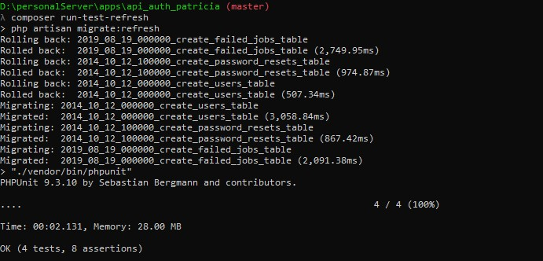

# Authentication System in Laravel
### SETUP
Setup for the project is relatively according to standard. 
1. Pull the project
2. Install Dependencies (composer and npm)
3. Configure database
4. Generate encryption key
5. Run migrations 
6. Launch


##### Pull the Project
The Project is available on [github here](https://github.com/YoungMayor/api_auth_patricia.git).
You an add it to your local machine either by git pull command 
```cmd
git clone https://github.com/YoungMayor/api_auth_patricia.git api_auth_patricia
```


##### Install Dependencies
After the project has been pulled unto your local computer. You will need to install dependecies for the project. Start by changing your terminal directory to the directory where the project is located. 

This can be done on windows by running the below command
```cmd
cd api_auth_patricia
```
Then afterwards, you install the composer dependencies by running 
```cmd 
composer install
npm install
```
NOTE: Please ensure that you have composer and npm installed on your machine.


##### Configure Database
Database configuration is relatively easy. 
1. Create an empty database
2. Configure your environment
    ```cmd
    cp .env.example .env
    ```
3. configure your environment variables to reflect your database and mail settings


##### Generate encryption key 
Laravel requires you to have an app encryption key which is randomly generated and stored on your .env file. This can be created by running the below command on your terminal. 
```cmd 
php artisan key:generate
```

##### Run Migrations 
Running migrations would create the database tables the project needs. 
You can do this by running the below command on your terminal 
```cmd 
php artisan migrate
```


##### Launch 
Project setup has been completed and the project can now launch the project. 
If you do not have a local server installed on your machine. You can run the below command to serve the project
```cmd 
php artisan serve
```
That serves the project for local testing and usage. 


### HOW TO USE
This can be served using any API Testing Environment. 
PostMan has been used here, but you are free to use any

#### Registration 
To register an account, you are required to pass the following parameters via POST method to the `/api/register` endpoint. 
1. email 
2. password
3. password_confirmation
4. name


- Passing an invalid data would result in a 422 (unprocessable entity) error. 


- Passing valid data would return a 201 (created) HTTP Responsewith the user logged in and an authentication token generated for him as seen below


- Attempting to register a user email that has already been registered would also return a 422 error 
- 


#### Login
A user can be logged in by passing his email and password to the `/api/login/` endpoint via POST request

- Passing invalid login credentials be it invalid email or invalid password would return a 401 (unauthenticated) error. 


- Whereas, passing valid credentials would return 200 (ok) and the authentication token in the body of the response and also attached to the response.


#### User Details 
To get user details. You only need to send a GET request to the `/api/user` endpoint with the authentication token passed like `Authentication: Bearer ${token_here}`
When the token is valid, a 200 (ok) response would be received from the endpoint

However if the token is not passed properly, then a 401 (unauthenticated) error is received

The same would be received if the token is invalid. i.e. it is expired or incorrect


### TESTING
System Testing has been integrated into composer and can be run by running the below command on your terminal. 
```cmd
composer run-test
```
That would run a PHPUnit test on your console.
. 
Also included is an option to test with a refreshed database. 
This can be done by running on your terminal
```cmd 
composer run-test-refresh
```
This would refresh your database then run the tests
. 
